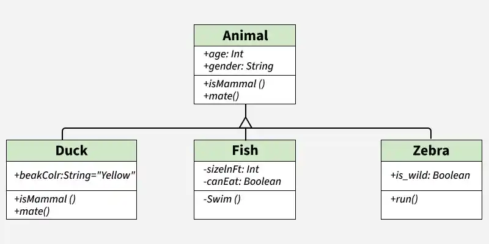
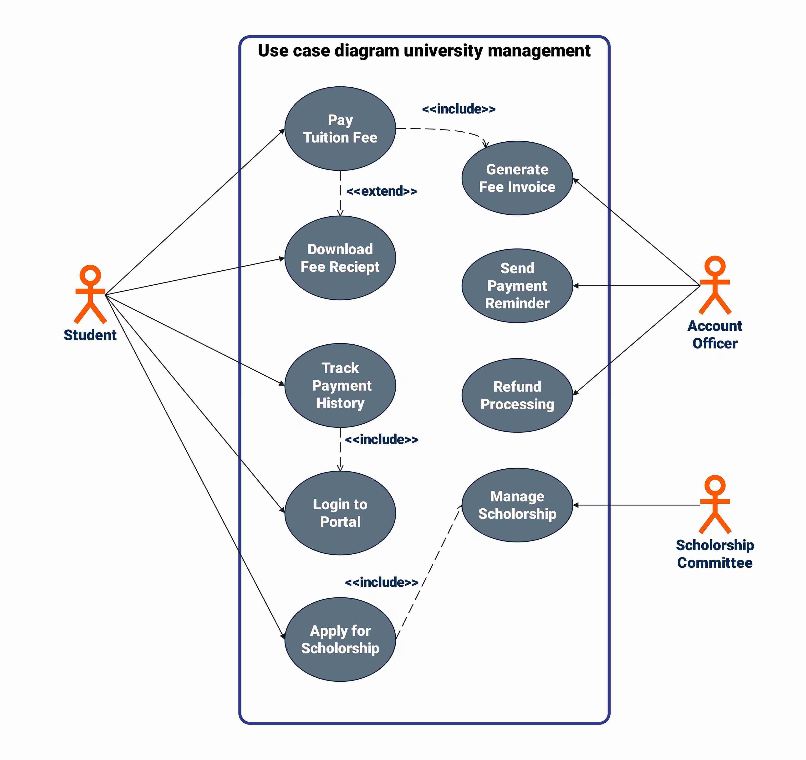
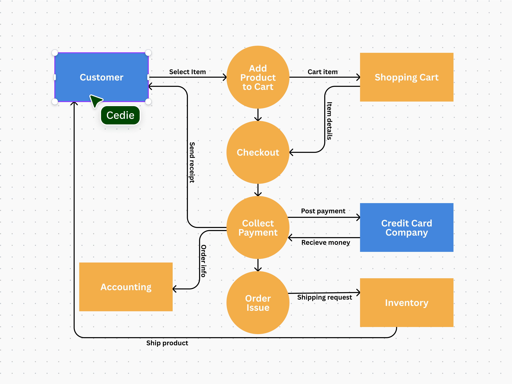

# 1.1 ความหมายของการออกแบบซอฟต์แวร์

การออกแบบซอฟต์แวร์ (Software Design) คือ กระบวนการกำหนดโครงสร้าง องค์ประกอบ
และรายละเอียดของระบบซอฟต์แวร์ เพื่อให้สามารถพัฒนาและทำงานได้ตามความต้องการของผู้ใช้
โดยเป็นขั้นตอนที่เชื่อมโยงระหว่างการวิเคราะห์ความต้องการ (Requirements Analysis)
กับการพัฒนาโปรแกรมจริง

วัตถุประสงค์ของการออกแบบซอฟต์แวร์ ได้แก่

-   กำหนดสถาปัตยกรรมของระบบ
-   แบ่งระบบออกเป็นโมดูลหรือส่วนย่อย
-   ออกแบบข้อมูลและฐานข้อมูล
-   ออกแบบส่วนติดต่อผู้ใช้ (User Interface)
-   ทำให้ซอฟต์แวร์สามารถบำรุงรักษาและขยายได้ง่าย

------------------------------------------------------------------------

# 1.2 กระบวนการออกแบบซอฟต์แวร์

กระบวนการออกแบบซอฟต์แวร์สามารถแบ่งออกเป็นขั้นตอนหลัก ดังนี้

## 1) การออกแบบสถาปัตยกรรม (Architectural Design)

กำหนดโครงสร้างโดยรวมของระบบ ความสัมพันธ์ระหว่างองค์ประกอบต่าง ๆ
และรูปแบบสถาปัตยกรรมที่เหมาะสม เช่น Client-Server หรือ Microservices

## 2) การออกแบบข้อมูล (Data Design)

กำหนดโครงสร้างข้อมูล ฐานข้อมูล และความสัมพันธ์ของข้อมูลภายในระบบ

## 3) การออกแบบส่วนประกอบ (Component Design)

แบ่งระบบออกเป็นโมดูล คลาส หรือฟังก์ชัน พร้อมกำหนดหน้าที่ของแต่ละส่วน

## 4) การออกแบบส่วนติดต่อผู้ใช้ (User Interface Design)

ออกแบบหน้าจอ การโต้ตอบ และประสบการณ์ของผู้ใช้

## 5) การตรวจสอบและปรับปรุงแบบออกแบบ (Design Review)

ประเมินความถูกต้อง ประสิทธิภาพ และความเหมาะสมของแบบออกแบบก่อนเริ่มพัฒนา

------------------------------------------------------------------------

# 1.3 คุณภาพและการประเมินคุณภาพงานออกแบบซอฟต์แวร์

คุณภาพของงานออกแบบซอฟต์แวร์มีผลโดยตรงต่อคุณภาพของระบบที่พัฒนาขึ้น
โดยสามารถประเมินได้จากปัจจัยต่อไปนี้

  ------------------------------------------------------------------------
  คุณลักษณะ                             คำอธิบาย
  ----------------------------------- ------------------------------------
  ความถูกต้อง (Correctness)             แบบออกแบบตอบสนองต่อความต้องการของผู้ใช้

  ความเข้าใจง่าย (Understandability)    นักพัฒนาสามารถอ่านและทำความเข้าใจได้ง่าย

  ความยืดหยุ่น (Flexibility)             รองรับการเปลี่ยนแปลงในอนาคต

  ความสามารถในการบำรุงรักษา             แก้ไขและปรับปรุงได้ง่าย
  (Maintainability)                   

  การนำกลับมาใช้ใหม่ (Reusability)       สามารถนำองค์ประกอบไปใช้ซ้ำได้

  ประสิทธิภาพ (Efficiency)              ใช้ทรัพยากรอย่างเหมาะสม
  ------------------------------------------------------------------------

## วิธีการประเมินคุณภาพ

-   การตรวจสอบแบบออกแบบ (Design Review)
-   การทดสอบต้นแบบ (Prototype Testing)
-   การใช้ตัวชี้วัดทางซอฟต์แวร์ (Software Metrics)
-   การประเมินโดยผู้เชี่ยวชาญ (Expert Evaluation)

------------------------------------------------------------------------

# 1.4 แนวคิดด้านการออกแบบซอฟต์แวร์

## 1) Abstraction

การซ่อนรายละเอียดที่ไม่จำเป็นและแสดงเฉพาะส่วนสำคัญของระบบ

## 2) Modularity

การแบ่งระบบออกเป็นโมดูลย่อยเพื่อลดความซับซ้อน

## 3) Encapsulation

การรวมข้อมูลและพฤติกรรมไว้ภายในหน่วยเดียวกัน และซ่อนรายละเอียดภายใน

## 4) Separation of Concerns

การแยกหน้าที่ของแต่ละส่วนออกจากกันอย่างชัดเจน

## 5) Coupling และ Cohesion

-   Coupling คือ ระดับการพึ่งพาระหว่างโมดูล ควรมีค่าต่ำ
-   Cohesion คือ ความสัมพันธ์ภายในโมดูล ควรมีค่าสูง

## 6) Refactoring

การปรับปรุงโครงสร้างของโปรแกรมโดยไม่เปลี่ยนแปลงพฤติกรรมของระบบ

------------------------------------------------------------------------

# 1.5 แบบจำลองการออกแบบซอฟต์แวร์

แบบจำลองการออกแบบซอฟต์แวร์เป็นเครื่องมือที่ใช้แสดงโครงสร้างและพฤติกรรมของระบบ

## 1) แบบจำลองเชิงโครงสร้าง (Structural Model)

ใช้แสดงโครงสร้างของระบบและความสัมพันธ์ระหว่างองค์ประกอบต่าง ๆ

ตัวอย่าง

-   Class Diagram
-   Object Diagram
-   Package Diagram
-   Component Diagram
-   Deployment Diagram

[https://www.geeksforgeeks.org/system-design/unified-modeling-language-uml-class-diagrams/](https://www.geeksforgeeks.org/system-design/unified-modeling-language-uml-class-diagrams/)

## 2) แบบจำลองเชิงพฤติกรรม (Behavioral Model)

ใช้แสดงพฤติกรรมและการทำงานของระบบ

ตัวอย่าง

-   Use Case Diagram
-   Activity Diagram
-   Sequence Diagram
-   State Diagram

[https://edrawmax.wondershare.com/examples/use-case-diagram-examples.html](https://edrawmax.wondershare.com/examples/use-case-diagram-examples.html)

## 3) แบบจำลองเชิงข้อมูล (Data Model)

ใช้แสดงโครงสร้างข้อมูลและความสัมพันธ์ของข้อมูล

ตัวอย่าง

-   Entity Relationship Diagram (ERD)
-   Data Flow Diagram (DFD)

[https://www.canva.com/online-whiteboard/data-flow-diagrams/](https://www.canva.com/online-whiteboard/data-flow-diagrams/)

------------------------------------------------------------------------

# สรุป

การออกแบบซอฟต์แวร์เป็นขั้นตอนสำคัญที่ช่วยกำหนดโครงสร้างและแนวทางการพัฒนาระบบให้มีประสิทธิภาพ
กระบวนการออกแบบประกอบด้วยการออกแบบสถาปัตยกรรม ข้อมูล ส่วนประกอบ และส่วนติดต่อผู้ใช้
โดยคุณภาพของงานออกแบบสามารถประเมินได้จากความถูกต้อง ความยืดหยุ่น
และความสามารถในการบำรุงรักษา นอกจากนี้ แนวคิดต่าง ๆ เช่น Abstraction,
Modularity และ Encapsulation ยังช่วยลดความซับซ้อนของระบบ
ส่วนแบบจำลองการออกแบบ เช่น UML และ ERD ช่วยให้ทีมพัฒนาเข้าใจระบบได้อย่างชัดเจน
