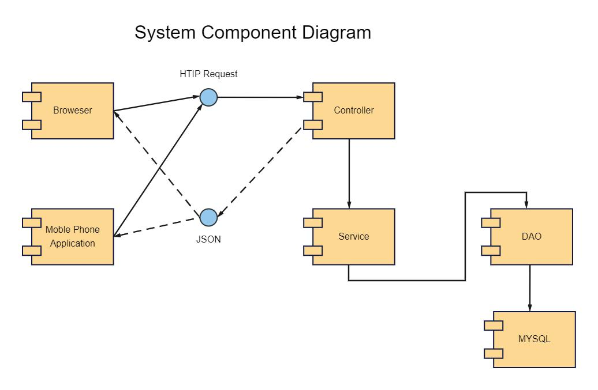
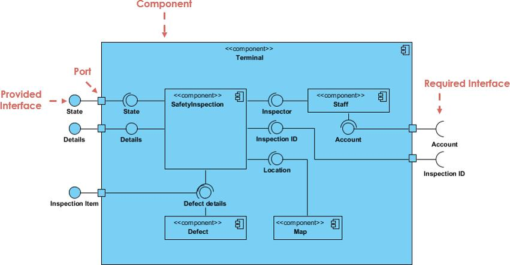
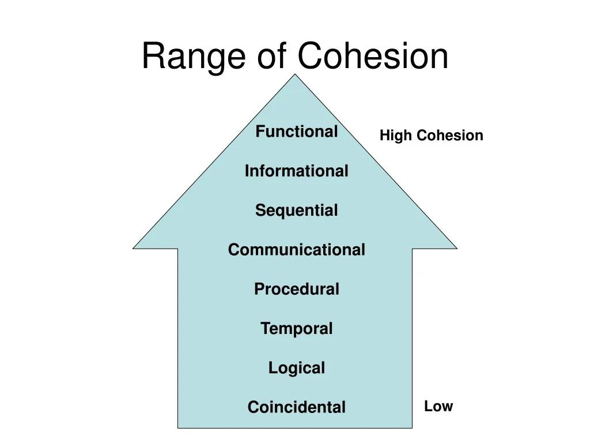
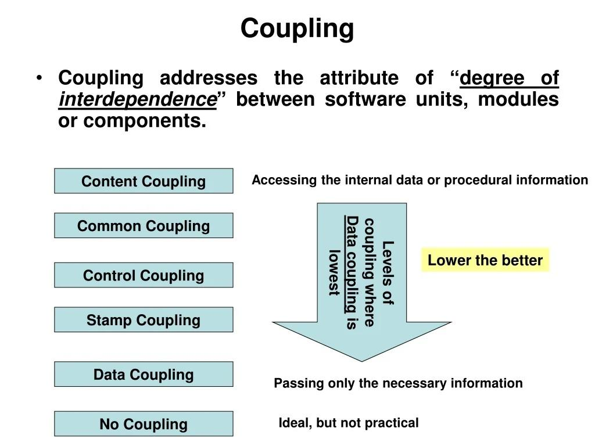

# การออกแบบระดับคอมโพเนนท์ (Component-Level Design)

## 1.1 ความหมายของคอมโพเนนท์ (Component)

**คอมโพเนนท์ (Component)** คือ ส่วนประกอบหนึ่งของซอฟต์แวร์ที่ถูกออกแบบให้มีหน้าที่หรือความรับผิดชอบเฉพาะ และสามารถทำงานร่วมกับส่วนประกอบอื่นผ่านอินเทอร์เฟซ (Interface) ที่กำหนดไว้

คอมโพเนนท์อาจเป็นได้ทั้ง

- โมดูล (Module)
- คลาส (Class)
- กลุ่มของคลาส
- ฟังก์ชันหรือชุดฟังก์ชัน
- ไลบรารี (Library)
- บริการ (Service)

แนวคิดสำคัญคือการแบ่งระบบขนาดใหญ่ออกเป็นส่วนย่อยที่จัดการได้ง่าย โดยแต่ละส่วนมีหน้าที่ชัดเจนและสามารถติดต่อกับส่วนอื่นผ่านช่องทางที่กำหนด

**ตัวอย่าง:** ระบบจองคิวร้านตัดผมอาจแบ่งเป็นคอมโพเนนท์ เช่น `Booking`, `Queue`, `Payment` และ `Notification` โดยแต่ละคอมโพเนนท์รับผิดชอบงานของตนเอง



[https://www.pinterest.com/pin/297870962867468845/?utm_source=chatgpt.com](https://www.pinterest.com/pin/297870962867468845/?utm_source=chatgpt.com)

---

## 1.2 ความหมายของการออกแบบระดับคอมโพเนนท์ (Component-Level Design)

**การออกแบบระดับคอมโพเนนท์ (Component-Level Design)** คือ กระบวนการออกแบบรายละเอียดภายในของคอมโพเนนท์แต่ละส่วนของระบบ รวมถึงกำหนดหน้าที่ ข้อมูล การทำงาน อินเทอร์เฟซ และความสัมพันธ์กับคอมโพเนนท์อื่น

การออกแบบระดับนี้เป็นขั้นตอนที่นำแบบจำลองระดับสถาปัตยกรรมหรือระดับระบบมาแตกออกเป็นรายละเอียดที่สามารถนำไปเขียนโปรแกรมได้จริง

สิ่งที่ควรกำหนดในการออกแบบ ได้แก่

1. หน้าที่และความรับผิดชอบของคอมโพเนนท์
2. ข้อมูลที่คอมโพเนนท์ต้องใช้และจัดเก็บ
3. กระบวนการหรืออัลกอริทึมภายใน
4. อินเทอร์เฟซสำหรับติดต่อกับคอมโพเนนท์อื่น
5. ความสัมพันธ์และการพึ่งพาระหว่างคอมโพเนนท์

**เป้าหมาย:** ทำให้ซอฟต์แวร์มีโครงสร้างที่เข้าใจง่าย แก้ไขและทดสอบได้ง่าย และสามารถนำส่วนประกอบกลับมาใช้ซ้ำได้



[www.cybermedian.com/case-study-component-diagram-for-an-e-commerce-system/?utm_source=chatgpt.com](https://www.cybermedian.com/case-study-component-diagram-for-an-e-commerce-system/?utm_source=chatgpt.com)

---

## 1.3 การออกแบบซอฟต์แวร์เชิงโครงสร้าง (Structured Software Design)

**การออกแบบซอฟต์แวร์เชิงโครงสร้าง (Structured Design)** เป็นแนวทางการออกแบบซอฟต์แวร์ที่มองระบบเป็นกลุ่มของกระบวนการหรือฟังก์ชัน และแบ่งระบบออกเป็นโมดูลย่อยตามหน้าที่

แนวคิดหลักคือ **การแบ่งปัญหาเป็นส่วนย่อย (Decomposition)** จากระบบขนาดใหญ่ไปสู่โมดูลที่เล็กลง โดยแต่ละโมดูลควรมีหน้าที่ชัดเจน

### ลักษณะสำคัญ

- เน้น **ฟังก์ชันหรือกระบวนการ (Function/Process)** เป็นหลัก
- แบ่งระบบออกเป็นโมดูลย่อย
- ใช้โครงสร้างแบบลำดับชั้นเพื่อแสดงความสัมพันธ์ระหว่างโมดูล
- ให้ความสำคัญกับการควบคุมการไหลของข้อมูลและการประมวลผล
- พยายามให้แต่ละโมดูลมี **Cohesion สูง** และมี **Coupling ต่ำ**

### ตัวอย่าง

ระบบสั่งซื้อสินค้าอาจแบ่งเป็น

```text
ระบบสั่งซื้อสินค้า
├── รับข้อมูลลูกค้า
├── จัดการสินค้า
├── คำนวณราคา
├── บันทึกคำสั่งซื้อ
└── ออกใบเสร็จ
```

แต่ละส่วนสามารถออกแบบเป็นฟังก์ชันหรือโมดูลแยกกัน

**ข้อดี:** เหมาะกับระบบที่สามารถแยกเป็นกระบวนการชัดเจน และช่วยให้การวิเคราะห์ลำดับการทำงานทำได้ง่าย

**ข้อจำกัด:** เมื่อระบบมีขนาดใหญ่และมีข้อมูลหรือสถานะที่ซับซ้อน การจัดการความสัมพันธ์ระหว่างข้อมูลและฟังก์ชันอาจทำได้ยากกว่าแนวทางเชิงวัตถุ

---

## 1.4 การออกแบบซอฟต์แวร์เชิงวัตถุ (Object-Oriented Software Design)

**การออกแบบซอฟต์แวร์เชิงวัตถุ (Object-Oriented Design: OOD)** เป็นแนวทางการออกแบบที่มองระบบเป็นกลุ่มของ **วัตถุ (Objects)** ซึ่งรวมข้อมูลและพฤติกรรมที่เกี่ยวข้องไว้ด้วยกัน

วัตถุถูกสร้างจาก **คลาส (Class)** โดยคลาสกำหนดข้อมูล (Attributes) และพฤติกรรมหรือเมธอด (Methods) ของวัตถุ

### แนวคิดสำคัญ

- **Encapsulation:** รวมข้อมูลและพฤติกรรมไว้ในหน่วยเดียว และควบคุมการเข้าถึงข้อมูล
- **Abstraction:** แสดงเฉพาะรายละเอียดที่จำเป็นและซ่อนรายละเอียดที่ไม่จำเป็น
- **Inheritance:** ให้คลาสหนึ่งสืบทอดคุณสมบัติจากอีกคลาสหนึ่ง
- **Polymorphism:** วัตถุต่างชนิดสามารถตอบสนองต่อคำสั่งหรืออินเทอร์เฟซเดียวกันในรูปแบบที่แตกต่างกัน

### ตัวอย่าง

ในระบบจองคิวร้านตัดผม อาจมีคลาส

```text
Customer
- customer_id
- name
+ bookService()

Booking
- booking_id
- booking_date
- status
+ createBooking()
+ cancelBooking()

Payment
- payment_id
- amount
- payment_status
+ processPayment()
```

แต่ละคลาสรับผิดชอบข้อมูลและพฤติกรรมของตนเอง และสามารถร่วมมือกันเพื่อให้ระบบทำงาน

**ข้อดี:** เหมาะกับระบบขนาดใหญ่ที่มีข้อมูลและพฤติกรรมซับซ้อน ช่วยให้สามารถนำคลาสกลับมาใช้ซ้ำและดูแลรักษาระบบได้ง่าย

---

## 1.5 Cohesion

**Cohesion (ความเป็นเอกภาพของโมดูล)** คือ ระดับที่องค์ประกอบภายในคอมโพเนนท์หรือโมดูลมีความเกี่ยวข้องและมุ่งไปสู่หน้าที่เดียวกันมากน้อยเพียงใด

หลักการออกแบบที่ดีคือ **High Cohesion** หมายถึง ภายในคอมโพเนนท์หนึ่งควรมีหน้าที่ที่เกี่ยวข้องกันอย่างมากและมีความรับผิดชอบที่ชัดเจน

### ตัวอย่าง

```text
Payment
├── calculateAmount()
├── processPayment()
└── generateReceipt()
```

ฟังก์ชันเหล่านี้เกี่ยวข้องกับการชำระเงิน จึงมี Cohesion สูง

ในทางตรงกันข้าม หากโมดูลเดียวมีทั้ง

```text
Payment
├── processPayment()
├── sendEmail()
├── calculateEmployeeSalary()
└── generateProductReport()
```

จะมี Cohesion ต่ำ เพราะมีหน้าที่หลายประเภทที่ไม่เกี่ยวข้องกัน

### ระดับของ Cohesion

จากต่ำไปสูงโดยทั่วไป ได้แก่

1. **Coincidental Cohesion** – สิ่งที่อยู่ในโมดูลถูกนำมารวมกันโดยไม่มีความสัมพันธ์ที่ชัดเจน
2. **Logical Cohesion** – รวมงานประเภทเดียวกัน แต่เลือกทำงานต่างกันตามเงื่อนไข
3. **Temporal Cohesion** – รวมงานที่เกิดขึ้นในช่วงเวลาเดียวกัน เช่น การเริ่มต้นระบบ
4. **Procedural Cohesion** – งานต่าง ๆ ต้องทำตามลำดับขั้นตอนเดียวกัน
5. **Communicational Cohesion** – งานต่าง ๆ ทำงานกับข้อมูลหรือผลลัพธ์ชุดเดียวกัน
6. **Sequential Cohesion** – ผลลัพธ์จากงานหนึ่งถูกนำไปใช้เป็นข้อมูลของงานถัดไป
7. **Functional Cohesion** – ทุกส่วนร่วมกันทำหน้าที่เดียวที่ชัดเจน ถือเป็นระดับที่ดีมาก

**หลักจำง่าย:**

> Cohesion สูง = ภายในโมดูลมีหน้าที่ที่เกี่ยวข้องกันมาก



[www.slideserve.com/wrightcharles/coupling-and-cohesion-powerpoint-ppt-presentation?utm_source=chatgpt.com](https://www.slideserve.com/wrightcharles/coupling-and-cohesion-powerpoint-ppt-presentation?utm_source=chatgpt.com)

---


## 1.6 Coupling

**Coupling (ความเชื่อมโยงระหว่างโมดูล)** คือ ระดับการพึ่งพาระหว่างคอมโพเนนท์หรือโมดูลหนึ่งกับอีกโมดูลหนึ่ง

หลักการออกแบบที่ดีคือ **Low Coupling** หมายถึง แต่ละโมดูลควรพึ่งพาโมดูลอื่นให้น้อยที่สุด เพื่อให้สามารถแก้ไขหรือเปลี่ยนแปลงโมดูลหนึ่งโดยส่งผลกระทบต่อโมดูลอื่นน้อยที่สุด

### ตัวอย่าง Low Coupling

```text
Booking → Payment
```

Booking ส่งข้อมูลที่จำเป็น เช่น `booking_id` และ `amount` ให้ Payment ผ่าน Interface ที่กำหนดไว้ โดยไม่ต้องรู้รายละเอียดภายในของ Payment

### ตัวอย่าง High Coupling

ถ้า `Booking` เข้าไปแก้ไขตัวแปรหรือรายละเอียดภายในของ `Payment` โดยตรง เมื่อ Payment เปลี่ยนโครงสร้างภายใน Booking ก็อาจต้องแก้ตาม ทำให้ระบบดูแลรักษายาก

### ประเภทของ Coupling

โดยทั่วไปสามารถเรียงจาก **แนวโน้มที่ไม่ดีไปสู่แนวโน้มที่ดี** ได้ดังนี้

1. **Content Coupling** – โมดูลหนึ่งเข้าไปพึ่งพาหรือแก้ไขรายละเอียดภายในของอีกโมดูลโดยตรง
2. **Common Coupling** – หลายโมดูลใช้ข้อมูลร่วมกัน เช่น Global Data
3. **External Coupling** – โมดูลพึ่งพาอินเทอร์เฟซหรือรูปแบบที่กำหนดโดยระบบภายนอก
4. **Control Coupling** – โมดูลหนึ่งส่งข้อมูลควบคุมเพื่อกำหนดการทำงานของอีกโมดูล
5. **Stamp Coupling** – ส่งโครงสร้างข้อมูลขนาดใหญ่ให้กัน ทั้งที่อีกโมดูลใช้เพียงบางส่วน
6. **Data Coupling** – โมดูลสื่อสารกันโดยส่งเฉพาะข้อมูลที่จำเป็น ถือเป็นรูปแบบที่ดี

**หลักจำง่าย:**

> Coupling ต่ำ = โมดูลพึ่งพากันน้อย



[www.slideserve.com/wrightcharles/coupling-and-cohesion-powerpoint-ppt-presentation?utm_source=chatgpt.com](https://www.slideserve.com/wrightcharles/coupling-and-cohesion-powerpoint-ppt-presentation?utm_source=chatgpt.com)

---

# สรุปความสัมพันธ์ของ Cohesion และ Coupling

หลักสำคัญของการออกแบบระดับคอมโพเนนท์คือ

> **High Cohesion + Low Coupling = การออกแบบที่ดี**

| แนวคิด | หมายถึง                                         | เป้าหมาย |
| ------------ | ------------------------------------------------------ | ---------------- |
| Cohesion     | ความเกี่ยวข้องกันภายในโมดูล | สูง (High)    |
| Coupling     | การพึ่งพาระหว่างโมดูล             | ต่ำ (Low)     |

เมื่อ **Cohesion สูง** แต่ละคอมโพเนนท์จะมีหน้าที่ชัดเจน ส่วนเมื่อ **Coupling ต่ำ** คอมโพเนนท์ต่าง ๆ จะไม่ผูกติดกันมากเกินไป ส่งผลให้ระบบสามารถแก้ไข ทดสอบ บำรุงรักษา และนำส่วนประกอบกลับมาใช้ซ้ำได้ง่ายขึ้น

---

# เปรียบเทียบ Structured Design กับ Object-Oriented Design

| หัวข้อ                         | Structured Design                                  | Object-Oriented Design                                             |
| ------------------------------------ | -------------------------------------------------- | ------------------------------------------------------------------ |
| สิ่งที่มองเป็นหลัก | ฟังก์ชัน/กระบวนการ                | วัตถุและคลาส                                           |
| การแบ่งระบบ               | แบ่งเป็นโมดูลหรือฟังก์ชัน | แบ่งเป็นคลาส/วัตถุ                                |
| ข้อมูล                         | มักแยกจากกระบวนการ               | รวมข้อมูลกับพฤติกรรม                           |
| แนวคิดสำคัญ               | Decomposition, Data Flow                           | Encapsulation, Abstraction, Inheritance, Polymorphism              |
| เหมาะกับ                     | ระบบที่เน้นกระบวนการ           | ระบบที่มีข้อมูลและพฤติกรรมซับซ้อน |

## สรุปสั้น ๆ

- **Component** = ส่วนประกอบย่อยของซอฟต์แวร์ที่มีหน้าที่เฉพาะ
- **Component-Level Design** = การออกแบบรายละเอียดของแต่ละส่วนประกอบและวิธีที่ส่วนประกอบต่าง ๆ ติดต่อกัน
- **Structured Design** = ออกแบบโดยเน้นฟังก์ชันและกระบวนการ
- **Object-Oriented Design** = ออกแบบโดยเน้นวัตถุ คลาส ข้อมูล และพฤติกรรม
- **Cohesion** = ความสัมพันธ์ของสิ่งต่าง ๆ *ภายใน* โมดูล → ควรสูง
- **Coupling** = ความพึ่งพา *ระหว่าง* โมดูล → ควรต่ำ
