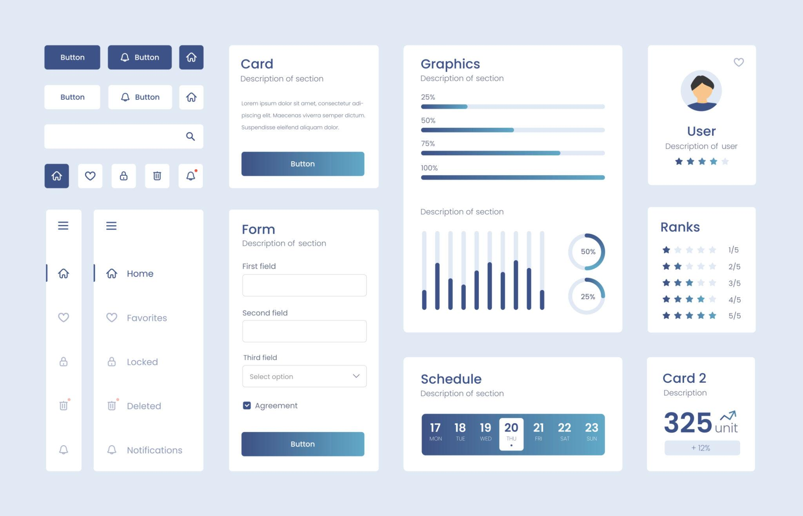
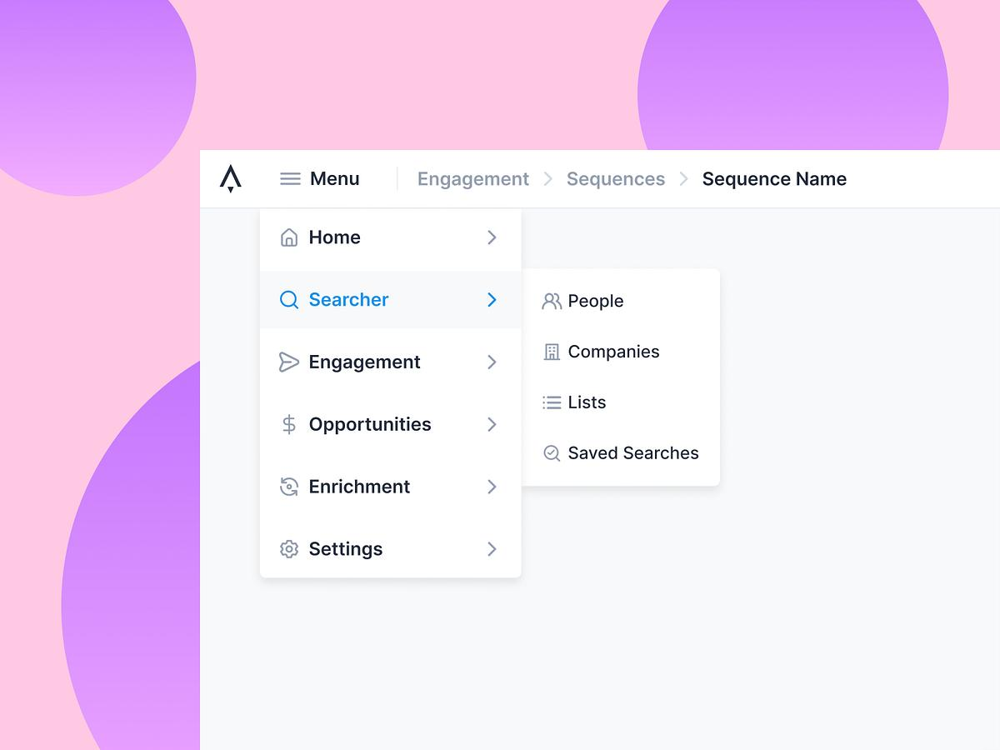
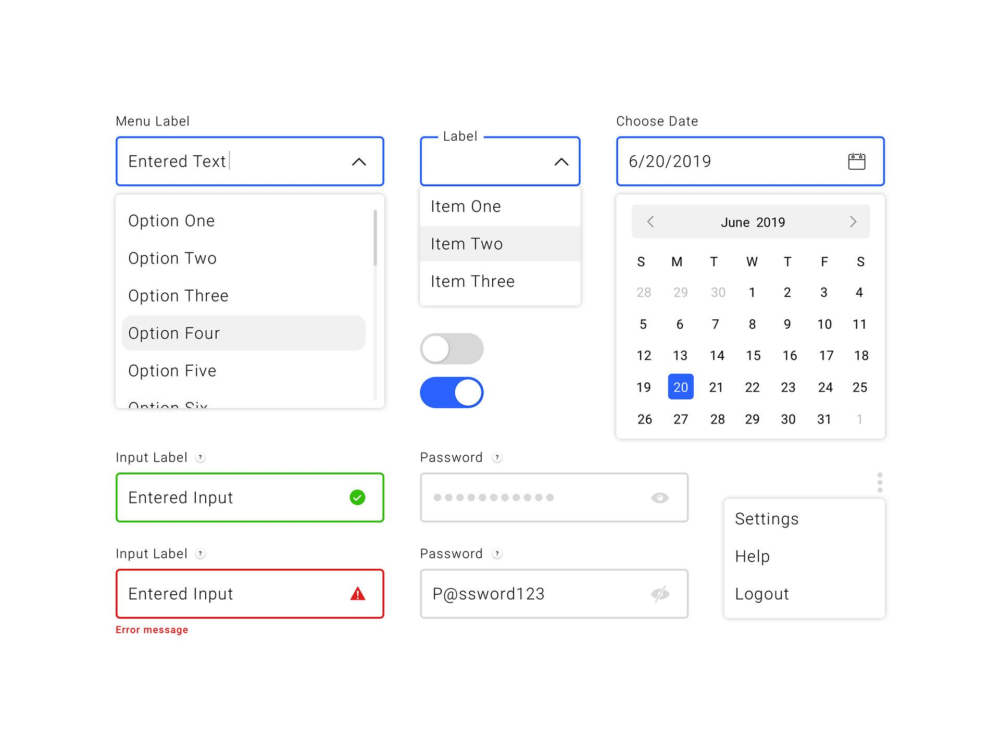
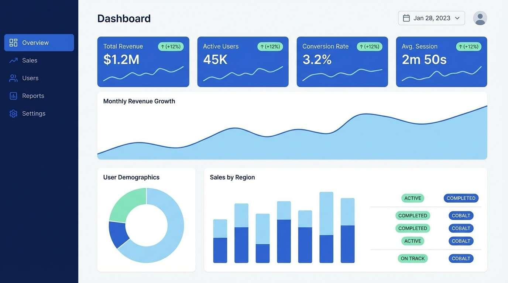

# การออกแบบส่วนต่อประสานกับผู้ใช้ (User Interface Design)

## 1. การออกแบบส่วนต่อประสานกับผู้ใช้ (User Interface Design)

**การออกแบบส่วนต่อประสานกับผู้ใช้ (User Interface Design หรือ UI Design)** คือ กระบวนการออกแบบสิ่งที่ผู้ใช้มองเห็นและโต้ตอบกับระบบ เช่น หน้าจอ เมนู ปุ่ม แบบฟอร์ม ไอคอน ข้อความ และกล่องโต้ตอบ เพื่อให้ผู้ใช้สามารถทำงานกับซอฟต์แวร์ได้อย่างเข้าใจง่าย มีประสิทธิภาพ และเกิดข้อผิดพลาดน้อย

UI เป็นส่วนหนึ่งของประสบการณ์ผู้ใช้ (User Experience: UX) โดย UI เน้นสิ่งที่ผู้ใช้เห็นและโต้ตอบโดยตรง ขณะที่ UX ครอบคลุมประสบการณ์โดยรวม เช่น ความง่ายในการใช้งาน ประสิทธิภาพ การตอบสนอง และการจัดการข้อผิดพลาดของระบบ

---

## 1.1 ความหมายของส่วนต่อประสานกับผู้ใช้ (User Interface)

**ส่วนต่อประสานกับผู้ใช้ (User Interface: UI)** คือ จุดเชื่อมต่อระหว่างผู้ใช้กับระบบคอมพิวเตอร์หรือซอฟต์แวร์ ซึ่งทำให้ผู้ใช้สามารถส่งคำสั่งหรือข้อมูลเข้าสู่ระบบ และรับข้อมูลหรือผลลัพธ์จากระบบได้

องค์ประกอบของ UI ที่พบได้ทั่วไป ได้แก่

- **Input Controls:** ช่องกรอกข้อมูล ปุ่ม Checkbox Radio Button และ Dropdown
- **Navigation Components:** เมนู แท็บ Breadcrumb และ Pagination
- **Informational Components:** Notification, Progress Bar, Tooltip และ Message Box
- **Containers:** Sidebar, Accordion และส่วนที่ใช้จัดกลุ่มเนื้อหา

### ตัวอย่าง

ในระบบทั่วไป UI อาจประกอบด้วย



[www.coursera.org/ca/articles/ui-design?utm_source=chatgpt.com](https://www.coursera.org/ca/articles/ui-design?utm_source=chatgpt.com)

---


## 1.2 หลักการออกแบบส่วนต่อประสานกับผู้ใช้

การออกแบบ UI ที่ดีควรให้ความสำคัญกับ **Usability** คือ ผู้ใช้สามารถเข้าใจและควบคุมระบบได้ รวมทั้งทำงานให้สำเร็จได้อย่างมีประสิทธิภาพ

หลักการสำคัญมีดังนี้

### 1. ความสอดคล้อง (Consistency)

ใช้รูปแบบ สี ตำแหน่ง ปุ่ม และคำศัพท์ในลักษณะเดียวกันทั่วทั้งระบบ เพื่อให้ผู้ใช้เรียนรู้การใช้งานได้ง่าย

**ตัวอย่าง:** ปุ่ม "บันทึก" ควรใช้รูปแบบเดียวกันในทุกหน้าที่มีการบันทึกข้อมูล

### 2. แสดงสถานะของระบบ (Visibility of System Status)

ระบบควรแจ้งให้ผู้ใช้ทราบว่าขณะนี้ระบบกำลังทำอะไร เช่น Loading, Progress Bar, Success Message หรือ Error Message [4]

**ตัวอย่าง:** เมื่อกดชำระเงิน ระบบแสดง "กำลังดำเนินการ..." จนกว่าการชำระเงินจะเสร็จ

### 3. ใช้ภาษาที่ผู้ใช้เข้าใจ

ควรใช้คำศัพท์ที่ตรงกับความเข้าใจของผู้ใช้ ไม่ใช้คำทางเทคนิคที่ผู้ใช้ทั่วไปไม่คุ้นเคย หากไม่จำเป็น

**ไม่ควร:** `Execute Transaction`

**ควร:** `ยืนยันการชำระเงิน`

### 4. ให้ผู้ใช้สามารถควบคุมระบบได้

ผู้ใช้ควรสามารถย้อนกลับ ยกเลิก หรือแก้ไขการกระทำได้เมื่อเหมาะสม เช่น ปุ่ม Cancel, Back, Undo และ Redo

### 5. ป้องกันข้อผิดพลาด

ออกแบบ UI เพื่อป้องกันไม่ให้ผู้ใช้กรอกข้อมูลผิดตั้งแต่แรก เช่น กำหนดชนิดข้อมูล ตรวจสอบค่าว่าง และแสดงคำแนะนำใต้ช่องกรอก

### 6. ให้ผู้ใช้จดจำมากกว่าต้องจำเอง

แสดงตัวเลือกและข้อมูลที่จำเป็นบนหน้าจอแทนการบังคับให้ผู้ใช้จำคำสั่งหรือข้อมูลจากหน้าก่อนหน้า

### 7. ลดความซับซ้อน

แสดงเฉพาะข้อมูลและคำสั่งที่จำเป็นต่อการทำงานในแต่ละขั้นตอน หลีกเลี่ยงองค์ประกอบที่ไม่เกี่ยวข้อง

### 8. ให้ข้อมูลตอบกลับ (Feedback)

หลังจากผู้ใช้ดำเนินการ ระบบควรแสดงผลลัพธ์อย่างเหมาะสม เช่น "บันทึกข้อมูลสำเร็จ" หรือแจ้งว่าต้องแก้ไขข้อมูลส่วนใด

### 9. ออกแบบให้รองรับผู้ใช้ที่หลากหลาย

ควรคำนึงถึงการเข้าถึง (Accessibility) เช่น สีและความคมชัด ขนาดตัวอักษร การใช้ข้อความร่วมกับสี และการใช้งานผ่านแป้นพิมพ์

หลักการเหล่านี้สอดคล้องกับแนวคิด Usability Heuristics ของ Jakob Nielsen ซึ่งครอบคลุมเรื่องสถานะของระบบ ความสอดคล้อง การป้องกันข้อผิดพลาด การควบคุมของผู้ใช้ และการช่วยเหลือเมื่อเกิดข้อผิดพลาด เป็นต้น [3][4]

---

## 1.3 กระบวนการออกแบบส่วนต่อประสานกับผู้ใช้

การออกแบบ UI ไม่ควรเริ่มจากการตกแต่งหน้าจอทันที แต่ควรเริ่มจากการทำความเข้าใจผู้ใช้และงานที่ผู้ใช้ต้องทำ จากนั้นออกแบบ ทดลอง และปรับปรุงเป็นรอบ ๆ

กระบวนการทั่วไปมีดังนี้

### ขั้นที่ 1: วิเคราะห์ผู้ใช้และความต้องการ

ศึกษาว่าใครเป็นผู้ใช้ ระบบต้องช่วยผู้ใช้ทำอะไร และผู้ใช้มีปัญหาอะไร

**ตัวอย่าง:** ระบบร้านตัดผมมีลูกค้า ช่างตัดผม และเจ้าของร้าน ซึ่งแต่ละกลุ่มต้องการข้อมูลและฟังก์ชันแตกต่างกัน

### ขั้นที่ 2: วิเคราะห์งานและลำดับการทำงาน

กำหนดขั้นตอนที่ผู้ใช้ต้องทำให้สำเร็จ เช่น

```text
เลือกบริการ
    ↓
เลือกวันและเวลา
    ↓
กรอกข้อมูล
    ↓
ตรวจสอบรายการ
    ↓
ยืนยันการจอง
```

### ขั้นที่ 3: ออกแบบโครงสร้างหน้าจอ

กำหนดว่าแต่ละหน้ามีข้อมูลและองค์ประกอบอะไร รวมถึงความสัมพันธ์ระหว่างหน้าต่าง ๆ

### ขั้นที่ 4: สร้าง Wireframe

สร้างแบบร่างหน้าจอโดยเน้นโครงสร้างและตำแหน่งขององค์ประกอบก่อน ยังไม่เน้นรายละเอียดด้านสีและการตกแต่ง

### ขั้นที่ 5: สร้าง Prototype

สร้างต้นแบบที่สามารถจำลองการกดปุ่ม การเปลี่ยนหน้า และลำดับการทำงาน เพื่อให้สามารถทดลองใช้งานก่อนพัฒนาจริง

### ขั้นที่ 6: ทดสอบกับผู้ใช้

ให้ผู้ใช้ทดลองทำงานจริง เช่น "ลองจองคิวตัดผมเวลา 18:00 น." แล้วสังเกตว่าผู้ใช้สามารถทำงานได้หรือไม่ มีจุดใดที่ทำให้สับสนหรือเกิดข้อผิดพลาด

### ขั้นที่ 7: ปรับปรุงและนำไปพัฒนา

นำผลการทดสอบกลับมาปรับ UI แล้วจึงพัฒนาเป็นระบบจริง กระบวนการนี้ควรทำซ้ำจนกว่าจะได้ UI ที่ตอบโจทย์ผู้ใช้

**สรุปกระบวนการ**

```text
วิเคราะห์ผู้ใช้
      ↓
วิเคราะห์งาน
      ↓
ออกแบบโครงสร้าง
      ↓
Wireframe
      ↓
Prototype
      ↓
ทดสอบกับผู้ใช้
      ↓
ปรับปรุง
      ↺
```

กระบวนการ UI จึงเป็นกระบวนการแบบ **Iterative** คือสามารถย้อนกลับไปแก้ไขขั้นตอนก่อนหน้าได้เมื่อพบปัญหา [2]

---

## 1.4 การออกแบบส่วนควบคุม (Navigation Design)

**Navigation Design** คือ การออกแบบวิธีที่ผู้ใช้ใช้เพื่อเคลื่อนที่ไปยังหน้าหรือส่วนต่าง ๆ ของระบบ รวมถึงการช่วยให้ผู้ใช้รู้ว่าอยู่ที่ใด อยู่ที่ไหนต่อ และสามารถกลับไปยังหน้าก่อนหน้าได้อย่างไร

องค์ประกอบที่ใช้ในการนำทาง เช่น

- Navigation Bar
- Sidebar
- Tab
- Breadcrumb
- Back Button
- Search
- Pagination
- Link
- Menu

### หลักการออกแบบ Navigation

1. **โครงสร้างชัดเจน** – จัดกลุ่มเมนูตามหน้าที่
2. **ชื่อเมนูเข้าใจง่าย** – ใช้คำที่สื่อความหมายตรงกับเนื้อหา
3. **มีรูปแบบสม่ำเสมอ** – ตำแหน่ง Navigation ควรคงที่
4. **บอกตำแหน่งปัจจุบัน** – เช่น Highlight เมนูที่กำลังเปิด หรือ Breadcrumb
5. **มีทางกลับ** – ผู้ใช้ควรสามารถย้อนกลับได้ง่าย
6. **ไม่สร้างเมนูมากเกินไป** – ลดความซับซ้อนของตัวเลือก
7. **รองรับ Search เมื่อมีข้อมูลจำนวนมาก** – ช่วยให้ผู้ใช้เข้าถึงข้อมูลได้เร็ว

### ตัวอย่าง



[dribbble.com/tags/breadcrumbs?utm_source=chatgpt.com](https://dribbble.com/tags/breadcrumbs?utm_source=chatgpt.com)

ผู้ใช้ควรสามารถเข้าใจได้ทันทีว่าแต่ละเมนูนำไปยังส่วนใดของระบบ

---

## 1.5 การออกแบบการนำเข้าข้อมูล (Input Design)

**Input Design** คือ การออกแบบวิธีและองค์ประกอบที่ใช้ให้ผู้ใช้ป้อนข้อมูลหรือคำสั่งเข้าสู่ระบบ โดยมีเป้าหมายให้ป้อนข้อมูลได้ง่าย รวดเร็ว ถูกต้อง และลดข้อผิดพลาด

### องค์ประกอบ Input ที่พบบ่อย

| องค์ประกอบ | เหมาะสำหรับ                                      |
| -------------------- | ----------------------------------------------------------- |
| Text Field           | ชื่อ ที่อยู่ หรือข้อความสั้น      |
| Text Area            | ข้อความยาวหรือความคิดเห็น          |
| Password Field       | รหัสผ่าน                                            |
| Radio Button         | เลือก 1 ตัวเลือกจากหลายตัวเลือก |
| Checkbox             | เลือกได้หลายตัวเลือก                    |
| Dropdown             | เลือกค่าจากรายการ                          |
| Date Picker          | เลือกวันที่                                      |
| Time Picker          | เลือกเวลา                                          |
| File Upload          | อัปโหลดไฟล์                                      |
| Button               | สั่งให้ระบบดำเนินการ                    |

### หลักการออกแบบ Input

**1. Label ต้องชัดเจน**

บอกผู้ใช้ว่าต้องกรอกอะไร เช่น `ชื่อ`, `เบอร์โทรศัพท์`, `อีเมล`

**2. ระบุข้อมูลที่จำเป็น**

แยกให้เห็นว่าช่องใดจำเป็นต้องกรอก เช่น ใช้เครื่องหมาย `*`

**3. ตรวจสอบข้อมูล (Validation)**

ตรวจสอบข้อมูลก่อนบันทึก เช่น

```text
Email: abc@
❌ รูปแบบอีเมลไม่ถูกต้อง
```

**4. แสดงข้อความ Error ที่เข้าใจง่าย**

ควรบอกว่าผิดตรงไหนและควรแก้อย่างไร ไม่ควรแสดงเพียงข้อความว่า `Invalid Input`

**5. ใช้ Input Control ให้เหมาะกับข้อมูล**

ถ้ามีตัวเลือกเพียงไม่กี่ตัวเลือกอาจใช้ Radio Button แต่ถ้ามีรายการจำนวนมากอาจใช้ Dropdown หรือ Search

**6. ลดการกรอกข้อมูลที่ไม่จำเป็น**

หากระบบสามารถดึงข้อมูลที่มีอยู่แล้วได้ ควรนำข้อมูลมาใช้แทนการให้ผู้ใช้กรอกซ้ำ



[www.behance.net/gallery/108777303/Dropdowns-Inputs-and-Menus?utm_source=chatgpt.com](https://www.behance.net/gallery/108777303/Dropdowns-Inputs-and-Menus?utm_source=chatgpt.com)

---

## 1.6 การออกแบบผลลัพธ์ (Output Design)

**Output Design** คือ การออกแบบวิธีที่ระบบนำเสนอข้อมูล ผลลัพธ์ หรือสถานะของการทำงานให้แก่ผู้ใช้ เพื่อให้ผู้ใช้สามารถอ่าน เข้าใจ และนำข้อมูลไปใช้ต่อได้อย่างมีประสิทธิภาพ

ผลลัพธ์อาจอยู่ในรูปแบบ

- ข้อความ
- ตาราง
- กราฟ
- รายงาน
- Dashboard
- Notification
- Confirmation Message
- ใบเสร็จ
- ไฟล์สำหรับดาวน์โหลด

### หลักการออกแบบ Output

**1. แสดงข้อมูลที่จำเป็น**

ไม่ควรแสดงข้อมูลมากเกินกว่าที่ผู้ใช้ต้องการ เพราะทำให้ค้นหาข้อมูลสำคัญได้ยาก

**2. จัดลำดับความสำคัญ**

ข้อมูลสำคัญควรเด่นกว่าข้อมูลรอง เช่น ยอดเงินรวมควรเห็นได้ชัดในหน้าชำระเงิน

**3. อ่านง่าย**

ใช้ขนาดตัวอักษร สี ระยะห่าง และการจัดกลุ่มที่เหมาะสม

**4. แสดงผลลัพธ์ทันเวลา**

เมื่อผู้ใช้ดำเนินการ ระบบควรแสดง Feedback ที่เหมาะสม เช่น Loading ระหว่างรอ และ Success/Error หลังการทำงานเสร็จ

**5. ใช้รูปแบบที่เหมาะกับข้อมูล**

เช่น ข้อมูลจำนวนมากเหมาะกับ Table ส่วนข้อมูลที่ต้องดูแนวโน้มเหมาะกับ Chart

### ตัวอย่าง 



[www.media.io/color-palette/arabian-nights-color-palette.html?utm_source=chatgpt.com](https://www.media.io/color-palette/arabian-nights-color-palette.html?utm_source=chatgpt.com)

---

# สรุปภาพรวม

การออกแบบส่วนต่อประสานกับผู้ใช้เป็นกระบวนการที่ทำให้ผู้ใช้สามารถโต้ตอบกับซอฟต์แวร์ได้อย่างมีประสิทธิภาพและเข้าใจง่าย โดยต้องพิจารณาทั้งหน้าตา การควบคุม การนำทาง การรับข้อมูล และการแสดงผล

```text
                    User Interface Design
                            │
        ┌───────────────────┼───────────────────┐
        ↓                   ↓                   ↓
   Navigation            Input               Output
   การนำทาง             การรับข้อมูล          การแสดงผล
        │                   │                   │
     เมนู/Tab          Form/Control       Table/Report
     Breadcrumb         Validation        Notification
     Search             Error Message      Dashboard
```

หัวใจสำคัญของ UI ที่ดีคือ **ผู้ใช้ควรสามารถเข้าใจระบบ เรียนรู้การใช้งาน ทำงานได้สำเร็จ และแก้ไขข้อผิดพลาดได้โดยไม่เกิดความสับสน**

---

# แหล่งอ้างอิง

Microsoft Learn, **Overview of UI Development – The Application User Interface and the User Experience**.
https://learn.microsoft.com/en-us/windows/win32/appuistart/the-process

UX Design Institute, **A Complete Guide to the UI Design Process**.
https://www.uxdesigninstitute.com/blog/guide-to-the-ui-design-process/

Usability Body of Knowledge, **Principles for Usable Design**.
https://www.usabilitybok.org/principles-for-usable-design/

Nielsen's Usability Heuristics, **10 Usability Heuristics for User Interface Design**.
https://www.nngroup.com/articles/ten-usability-heuristics/
