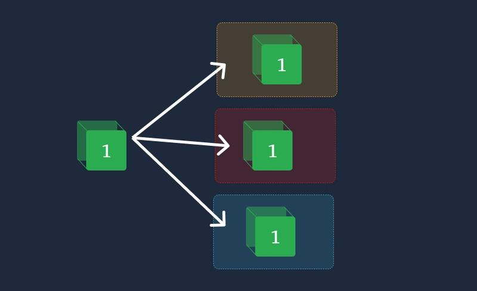
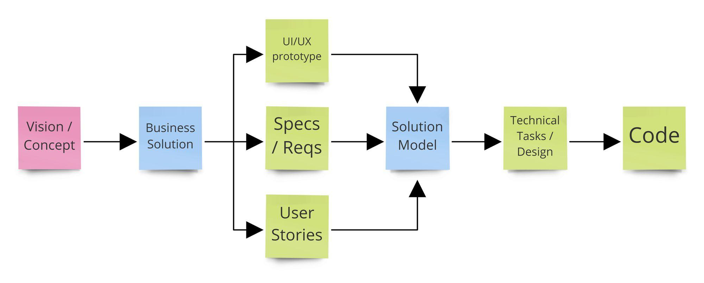

# การเขียนโปรแกรม (Program Writing)

## บทนำ

การเขียนโปรแกรมในงานวิศวกรรมซอฟต์แวร์ไม่ได้หมายถึงการเขียนคำสั่งให้โปรแกรมทำงานได้เพียงอย่างเดียว แต่ต้องคำนึงถึงความอ่านง่าย ความสม่ำเสมอ การบำรุงรักษา การนำกลับมาใช้ใหม่ การตรวจสอบ และความสอดคล้องระหว่างการออกแบบกับโค้ดที่พัฒนา แนวทางเหล่านี้ช่วยให้ซอฟต์แวร์สามารถพัฒนาต่อได้ง่ายและลดปัญหาเมื่อมีนักพัฒนาหลายคนทำงานร่วมกัน

## 1.1 มาตรฐานต่าง ๆ สำหรับการเขียนโปรแกรม (Standards for Programming)

มาตรฐานการเขียนโปรแกรม (Coding Standards) คือข้อตกลงหรือแนวทางที่กำหนดรูปแบบและวิธีการเขียนโค้ดให้เป็นมาตรฐานเดียวกันภายในทีม โครงการ หรือองค์กร โดยทั่วไปครอบคลุมเรื่องการตั้งชื่อ การจัดรูปแบบโค้ด การจัดโครงสร้างไฟล์ การเขียนคอมเมนต์ การจัดการข้อผิดพลาด และแนวทางด้านความปลอดภัย เป้าหมายสำคัญคือทำให้โค้ดอ่านง่าย เข้าใจง่าย ดูแลรักษาและตรวจสอบได้ง่าย รวมทั้งช่วยให้สมาชิกในทีมทำงานร่วมกันได้อย่างสม่ำเสมอ

มาตรฐานที่ควรกำหนด เช่น

- **Naming Convention:** กำหนดรูปแบบการตั้งชื่อ class, function, variable, constant และไฟล์ให้สื่อความหมายและใช้รูปแบบเดียวกัน
- **Formatting:** กำหนด indentation, การเว้นวรรค, การขึ้นบรรทัด และการจัดวงเล็บให้สม่ำเสมอ
- **Code Organization:** กำหนดโครงสร้างไฟล์ โมดูล และฟังก์ชันให้เป็นระเบียบ
- **Comments และ Documentation:** กำหนดว่าเรื่องใดควรอธิบายด้วยคอมเมนต์ และควรเขียนในรูปแบบใด
- **Error Handling:** กำหนดแนวทางการตรวจสอบและจัดการข้อผิดพลาด
- **Quality และ Safety:** กำหนดแนวปฏิบัติเพื่อลด defect และความเสี่ยงของซอฟต์แวร์

ตัวอย่างมาตรฐานที่มีการเผยแพร่จริงคือ **GNU Coding Standards** ซึ่งมุ่งให้โปรแกรมมีความสะอาด สอดคล้อง พกพาได้ และมีความน่าเชื่อถือ แม้จะเน้นโปรแกรมภาษา C แต่หลักการหลายส่วนสามารถนำไปใช้กับภาษาอื่นได้ นอกจากนี้ IEEE ยังอธิบายว่า code standards ครอบคลุมข้อกำหนดด้าน naming, formatting, documentation และ safety เพื่อให้โค้ดอ่านง่าย ดูแลรักษาได้ และทำงานร่วมกันได้ดี

**สรุป:** มาตรฐานการเขียนโปรแกรมไม่ได้มีไว้เพื่อบังคับรูปแบบเพียงอย่างเดียว แต่เป็นเครื่องมือสร้างความสม่ำเสมอและลดต้นทุนในการอ่าน แก้ไข ทดสอบ และบำรุงรักษาโค้ด

## 1.2 แนวทางคำแนะนำสำหรับการนำกลับมาใช้ใหม่ (Guidelines for Reuse)

Software Reuse คือการนำซอฟต์แวร์หรือส่วนประกอบที่มีอยู่แล้ว เช่น function, class, library, module หรือ component มาใช้ในบริบทใหม่ แทนการพัฒนาทุกอย่างจากศูนย์ การ reuse สามารถลดเวลาและต้นทุนในการพัฒนา และช่วยใช้ประโยชน์จากส่วนประกอบที่ผ่านการทดสอบมาแล้ว อย่างไรก็ตาม การ reuse อาจเพิ่มความซับซ้อน เช่น dependency, ความเข้ากันได้ของเวอร์ชัน และข้อจำกัดของส่วนประกอบเดิม ดังนั้นจึงควรเลือก reuse อย่างเหมาะสม

แนวทางสำคัญ ได้แก่

1. **ค้นหาและประเมินสิ่งที่มีอยู่ก่อนสร้างใหม่** — ตรวจสอบว่ามี library, component หรือโค้ดที่ตอบโจทย์อยู่แล้วหรือไม่
2. **ออกแบบให้เป็น modular** — แยกส่วนประกอบให้มีหน้าที่ชัดเจน ลดการพึ่งพาระหว่างโมดูลมากเกินไป
3. **กำหนด interface ที่ชัดเจน** — ผู้ใช้ component ควรรู้ว่าจะส่งข้อมูลอะไรเข้าไปและจะได้รับอะไรกลับมา โดยไม่จำเป็นต้องรู้รายละเอียด implementation
4. **ลด coupling และเพิ่ม cohesion** — ส่วนประกอบที่นำกลับมาใช้ควรมีหน้าที่ชัดเจนและไม่ผูกติดกับบริบทเฉพาะมากเกินไป
5. **จัดทำ documentation** — ระบุวัตถุประสงค์ วิธีใช้งาน ข้อจำกัด dependency และเงื่อนไขที่จำเป็น
6. **ตรวจสอบ license และ compatibility** — โดยเฉพาะเมื่อนำ open-source software มาใช้ในโครงการ
7. **พิจารณาค่าใช้จ่ายรวม** — การ reuse ไม่ได้แปลว่าดีกว่าการเขียนใหม่เสมอ เพราะอาจมีค่าใช้จ่ายในการทำความเข้าใจ ดัดแปลง และดูแล dependency

งานวิจัยด้าน software reuse ยังแบ่งแนวทางการ reuse ได้หลายมิติ เช่น language-specific, design-specific, domain-specific, product-specific และ architecture-specific แสดงให้เห็นว่าการออกแบบเพื่อให้ reuse ได้ควรพิจารณาตั้งแต่ระดับภาษา การออกแบบ component ไปจนถึงสถาปัตยกรรมระบบ

**สรุป:** เป้าหมายของ reuse ไม่ใช่เพียง “เอาโค้ดเก่ามาใช้” แต่คือการเลือกและออกแบบส่วนประกอบให้สามารถนำไปใช้ซ้ำได้อย่างปลอดภัย เข้าใจง่าย และคุ้มค่าต่อการบำรุงรักษา

[dev.to/alsongarbuja/reusability-a-magic-potion-or-curse-in-disguise-4eaj?utm_source=chatgpt.com](https://dev.to/alsongarbuja/reusability-a-magic-potion-or-curse-in-disguise-4eaj?utm_source=chatgpt.com)

## 1.3 การใช้การออกแบบเป็นกรอบสำหรับการลงรหัสหรือการเขียนโปรแกรม (Using Design to Frame the Code)

การออกแบบซอฟต์แวร์ทำหน้าที่เป็นกรอบหรือแบบแผนก่อนเข้าสู่การเขียนโค้ด โดยกำหนดว่าระบบประกอบด้วยส่วนใด แต่ละส่วนมีหน้าที่อะไร มีข้อมูลไหลอย่างไร และส่วนต่าง ๆ ติดต่อกันอย่างไร จากนั้น programmer จึงนำการออกแบบไปแปลงเป็นโครงสร้างของโปรแกรมจริง

ตัวอย่างเช่น หากการออกแบบกำหนดระบบเป็นชั้น **UI → Service → Data Access → Database** นักพัฒนาควรเขียนโค้ดให้สอดคล้องกับการแบ่งชั้นดังกล่าว แทนที่จะให้ UI ติดต่อ database โดยตรง การทำเช่นนี้ช่วยให้โค้ดมีโครงสร้างตามที่ทีมออกแบบไว้ และทำให้การแก้ไขส่วนหนึ่งไม่กระทบส่วนอื่นโดยไม่จำเป็น

แนวทางสำคัญคือ

- **Match design with implementation:** โครงสร้างของโค้ดควรสะท้อนการออกแบบที่ได้รับอนุมัติ
- **รักษา abstraction:** รายละเอียดภายใน module ไม่ควรรั่วไหลไปยังส่วนอื่นโดยไม่จำเป็น
- **ใช้ชื่อและแนวคิดเดียวกัน:** ชื่อ class, module, service และ entity ในโค้ดควรสอดคล้องกับ design
- **แยกความรับผิดชอบ:** แต่ละ module/class ควรมีหน้าที่ชัดเจน
- **ตรวจสอบความแตกต่างระหว่าง design กับ code:** หากมีความจำเป็นต้องเปลี่ยน design ควรปรับเอกสารการออกแบบด้วย ไม่ควรปล่อยให้ design และ implementation ขัดแย้งกัน

การใช้ design เป็นกรอบช่วยป้องกันการเขียนโค้ดแบบเฉพาะหน้า (ad hoc coding) เพราะ programmer มีโครงสร้างและข้อจำกัดที่ชัดเจนก่อนเริ่ม implementation

**สรุป:** Design เปรียบเสมือนพิมพ์เขียว ส่วน code คือการก่อสร้างตามพิมพ์เขียวนั้น การมี design ที่ชัดเจนช่วยให้การเขียนโปรแกรมเป็นระบบ ลดความซับซ้อน และทำให้ระบบที่ได้ตรงกับความต้องการและสถาปัตยกรรมที่วางไว้

[no-kill-switch.ghost.io/the-anatomy-of-a-model-debt/?utm_source=chatgpt.com](https://no-kill-switch.ghost.io/the-anatomy-of-a-model-debt/?utm_source=chatgpt.com)

## 1.4 เอกสารภายในและเอกสารภายนอก (Internal and External Documentation)

Documentation คือข้อมูลที่อธิบายซอฟต์แวร์เพื่อช่วยให้ผู้พัฒนา ผู้ดูแลระบบ ผู้ทดสอบ หรือผู้ใช้งานเข้าใจวิธีการทำงานและวิธีใช้งานระบบ โดยสามารถแบ่งในภาพรวมเป็น **Internal Documentation** และ **External Documentation**

### Internal Documentation

เอกสารภายในมีเป้าหมายหลักเพื่อช่วยทีมพัฒนาและผู้ดูแลระบบเข้าใจรายละเอียดภายในของซอฟต์แวร์ เช่น

- คอมเมนต์ที่อธิบายเหตุผลหรือรายละเอียด implementation ที่ไม่สามารถเห็นได้จากโค้ดโดยตรง
- เอกสาร architecture และ design
- Coding conventions
- คู่มือการติดตั้ง development environment
- รายละเอียด API ภายในและ dependency
- ประวัติการเปลี่ยนแปลงและเหตุผลของการแก้ไข

Internal documentation มีประโยชน์มากเมื่อโครงการมีนักพัฒนาหลายคนหรือมีการส่งต่องาน เพราะช่วยให้คนอื่นสามารถเข้าใจและแก้ไขระบบได้โดยไม่ต้องเริ่มศึกษาทุกอย่างจากศูนย์

### External Documentation

เอกสารภายนอกมีเป้าหมายเพื่ออธิบายการใช้งานซอฟต์แวร์แก่ผู้ใช้ นักพัฒนาภายนอก หรือผู้ที่ต้องนำระบบไปติดตั้งและเชื่อมต่อ เช่น

- User Manual
- README
- API Documentation
- Installation Guide
- Configuration Guide
- Integration Guide
- คู่มือการใช้งานและข้อกำหนดของระบบ

ตัวอย่างเช่น README ควรอธิบายวัตถุประสงค์ของโครงการ คุณสมบัติหลัก dependency วิธีติดตั้ง วิธีใช้งาน และข้อมูลที่จำเป็นต่อการเริ่มต้นใช้งาน

สิ่งสำคัญคือ documentation ควรสอดคล้องกับซอฟต์แวร์เวอร์ชันปัจจุบัน ไม่ควรปล่อยให้เอกสารล้าสมัย เพราะอาจทำให้ผู้พัฒนาและผู้ใช้เข้าใจระบบผิด

### เปรียบเทียบ Internal และ External Documentation

| ประเด็น             | Internal Documentation                                               | External Documentation                                                                   |
| -------------------------- | -------------------------------------------------------------------- | ---------------------------------------------------------------------------------------- |
| กลุ่มเป้าหมาย | นักพัฒนา ผู้ดูแล และทีมงาน                   | ผู้ใช้ นักพัฒนาภายนอก หรือผู้ติดตั้งระบบ           |
| เนื้อหา             | รายละเอียด implementation และการพัฒนาภายใน | วิธีใช้งานและการเชื่อมต่อกับระบบ                         |
| ตัวอย่าง           | Comments, Design Document, Coding Guide                              | README, User Manual, API Guide                                                           |
| จุดประสงค์       | ช่วยพัฒนา แก้ไข ทดสอบ และบำรุงรักษา  | ช่วยให้ผู้ใช้หรือผู้พัฒนาภายนอกใช้งานระบบได้ |

## สรุปภาพรวม

การเขียนโปรแกรมที่ดีในบริบทของวิศวกรรมซอฟต์แวร์ต้องพิจารณามากกว่าการทำให้โปรแกรมทำงานได้ โดย **Programming Standards** ช่วยสร้างความสม่ำเสมอของโค้ด **Reuse Guidelines** ช่วยให้สามารถใช้ประโยชน์จาก component เดิมและลดการพัฒนาซ้ำ **Using Design to Frame the Code** ช่วยให้ implementation สอดคล้องกับสถาปัตยกรรมและการออกแบบ และ **Internal/External Documentation** ช่วยถ่ายทอดความรู้เกี่ยวกับระบบให้เหมาะกับกลุ่มผู้ใช้แต่ละประเภท ทั้งสี่ส่วนจึงสนับสนุนเป้าหมายเดียวกัน คือการสร้างซอฟต์แวร์ที่อ่านง่าย ดูแลรักษาได้ นำกลับมาใช้ใหม่ได้ และสามารถพัฒนาต่อในระยะยาว

## แหล่งอ้างอิง

1. Pfleeger, S. L. & Atlee, J. M., *Software Engineering: Theory and Practice*, Chapter 7: Writing the Programs. เนื้อหาบทนี้ครอบคลุม Standards for Programming, Guidelines for Reuse, Using Design to Frame the Code และ Internal and External Documentation.
2. GNU Project. *GNU Coding Standards*. อธิบายแนวทางเพื่อให้โปรแกรมมีความสอดคล้อง พกพาได้ น่าเชื่อถือ และดูแลรักษาได้
3. IEEE Technology Navigator. *Code Standards*. อธิบายความหมายและวัตถุประสงค์ของมาตรฐานด้าน source code
4. Home Office Engineering Guidance and Standards. *Write maintainable, reusable and evolutionary code*. แนวทางด้าน maintainability และ reuse
5. IBM. *What Is Code Documentation?* อธิบาย internal และ external documentation รวมถึงตัวอย่างเอกสารในโครงการซอฟต์แวร์
6. NASA NPARC Alliance. *Documentation Guidelines for Software Development*. แนวทางสำหรับ external documentation และ internal working documentation
