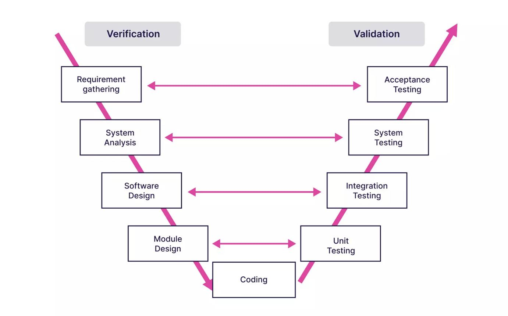
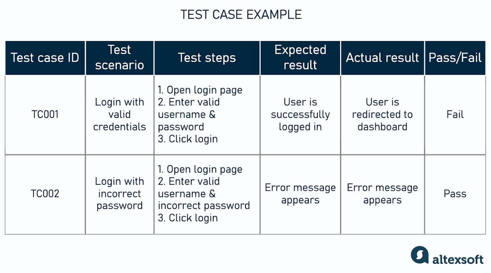
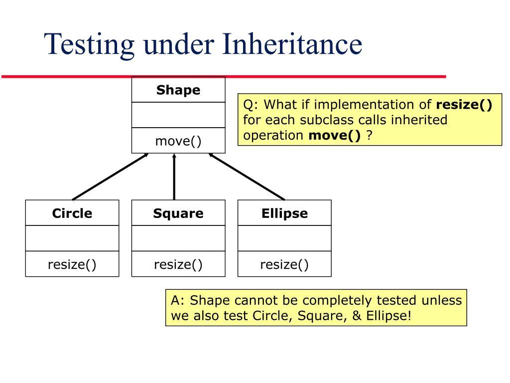
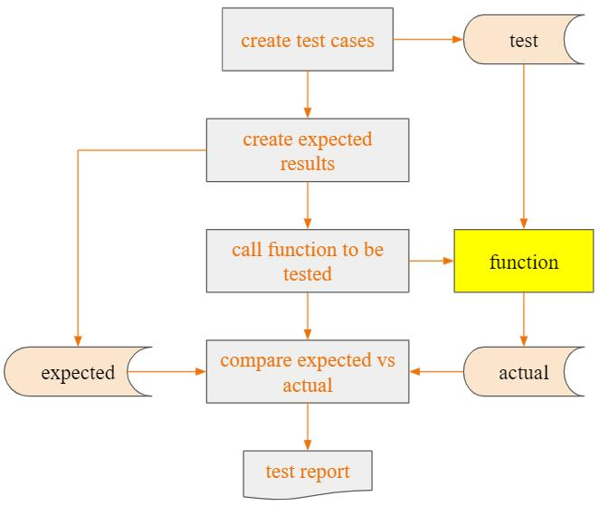
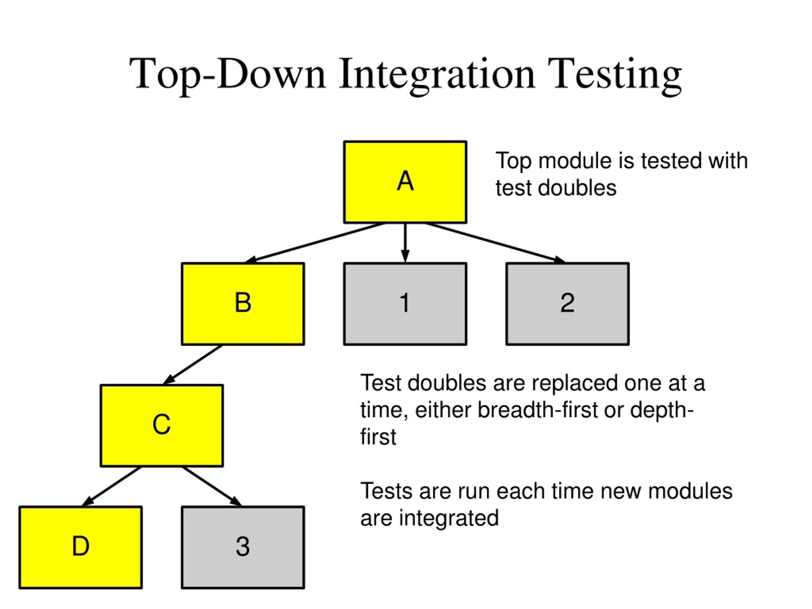

# กลยุทธ์การทดสอบ (Testing Strategies)

## บทนำ

การทดสอบซอฟต์แวร์ (Software Testing) เป็นกิจกรรมสำคัญในกระบวนการพัฒนาซอฟต์แวร์ มีจุดมุ่งหมายเพื่อค้นหาข้อบกพร่อง ประเมินว่าซอฟต์แวร์ทำงานตามข้อกำหนดหรือไม่ และสร้างความมั่นใจว่าระบบตอบสนองต่อความต้องการของผู้ใช้และผู้มีส่วนได้ส่วนเสียได้อย่างเหมาะสม การทดสอบไม่ได้มีเพียงการทดลองใช้โปรแกรมหลังจากเขียนเสร็จ แต่ครอบคลุมการวางแผน การออกแบบกรณีทดสอบ การดำเนินการทดสอบ การบันทึกผล และการวิเคราะห์ข้อบกพร่อง

มาตรฐาน ISO/IEC/IEEE 29119 เป็นชุดมาตรฐานสากลสำหรับการทดสอบซอฟต์แวร์ โดย Part 1 อธิบายแนวคิดและคำศัพท์ทั่วไป Part 2 อธิบายกระบวนการทดสอบ Part 3 อธิบายเอกสารการทดสอบ และ Part 4 อธิบายเทคนิคการออกแบบการทดสอบ [1][2][3][4]

## 1.1 ความหมายของการทดสอบซอฟต์แวร์ (Software Testing)

Software Testing คือกระบวนการประเมินและตรวจสอบซอฟต์แวร์โดยดำเนินการกับโปรแกรมหรือใช้วิธีการวิเคราะห์ที่เหมาะสม เพื่อค้นหาข้อบกพร่องและตรวจสอบว่าซอฟต์แวร์เป็นไปตามข้อกำหนดที่กำหนดไว้

การทดสอบมีวัตถุประสงค์สำคัญ ได้แก่

- ค้นหา defect หรือ failure ก่อนนำระบบไปใช้งานจริง
- ตรวจสอบว่าฟังก์ชันทำงานตาม requirement
- ตรวจสอบพฤติกรรมของระบบในกรณีปกติและกรณีผิดปกติ
- ลดความเสี่ยงและค่าใช้จ่ายที่อาจเกิดจากข้อผิดพลาด
- เพิ่มความมั่นใจในคุณภาพของซอฟต์แวร์

การทดสอบที่ดีไม่ได้หมายความว่า “ทดสอบจนพิสูจน์ได้ว่าไม่มี bug” เพราะการทดสอบไม่สามารถตรวจสอบ input และสถานการณ์ที่เป็นไปได้ทั้งหมดในระบบขนาดใหญ่ได้ แต่มีเป้าหมายเพื่อเพิ่มความมั่นใจและค้นหาข้อผิดพลาดที่สำคัญอย่างมีประสิทธิภาพ

## 1.2 การตรวจทานและการตรวจรับ (Verification and Validation)

Verification และ Validation หรือ V&V เป็นแนวคิดที่ใช้ประเมินว่าซอฟต์แวร์ถูกสร้างขึ้นอย่างถูกต้องและตอบโจทย์ที่ต้องการหรือไม่

### Verification

Verification เน้นคำถามว่า

> “เราสร้างผลิตภัณฑ์ถูกต้องตามข้อกำหนดและการออกแบบหรือไม่?”

เป็นการตรวจสอบว่าผลลัพธ์ของแต่ละขั้นตอนสอดคล้องกับข้อกำหนดหรือเอกสารที่กำหนดไว้หรือไม่ ตัวอย่างเช่น การตรวจ requirement, design review, code review และ static analysis

### Validation

Validation เน้นคำถามว่า

> “เราสร้างผลิตภัณฑ์ที่ถูกต้องสำหรับผู้ใช้หรือไม่?”

เป็นการตรวจสอบว่าซอฟต์แวร์ที่สร้างขึ้นสามารถตอบสนองความต้องการของลูกค้าและผู้ใช้ในสถานการณ์จริงหรือไม่ เช่น การทดสอบระบบและการทดสอบการตรวจรับโดยผู้ใช้

**สรุปความแตกต่าง**

| ประเด็น     | Verification                                              | Validation                                                                   |
| ------------------ | --------------------------------------------------------- | ---------------------------------------------------------------------------- |
| คำถามหลัก | สร้างผลิตภัณฑ์ถูกต้องหรือไม่  | สร้างผลิตภัณฑ์ที่ตรงความต้องการหรือไม่ |
| เน้น           | ข้อกำหนด การออกแบบ และ implementation | ความต้องการและการใช้งานจริง                       |
| ตัวอย่าง   | Review, Inspection, Static Analysis                       | System Testing, Acceptance Testing                                           |

[dataforest.ai/blog/clear-project-requirements-how-to-elicit-and-transfer-to-a-dev-team?utm_source=chatgpt.com](https://dataforest.ai/blog/clear-project-requirements-how-to-elicit-and-transfer-to-a-dev-team?utm_source=chatgpt.com)

## 1.3 ข้อกำหนดการทดสอบ (Test Specification) และกรณีทดสอบ (Test Case)

### Test Specification

Test Specification คือเอกสารหรือข้อกำหนดที่ระบุว่าจะทดสอบอะไร ทดสอบอย่างไร และใช้เกณฑ์ใดในการประเมินผล โดยอาจครอบคลุมวัตถุประสงค์ ขอบเขต เงื่อนไข ข้อมูลทดสอบ ขั้นตอน และเกณฑ์ผ่าน/ไม่ผ่าน

ตัวอย่างเช่น ระบบ Login อาจกำหนดว่า ต้องทดสอบการเข้าสู่ระบบด้วย username และ password ที่ถูกต้อง ผิด หรือเว้นว่าง รวมถึงกำหนดผลลัพธ์ที่คาดหวังของแต่ละกรณี

### Test Case

Test Case คือกรณีทดสอบที่ระบุข้อมูลและขั้นตอนสำหรับการตรวจสอบพฤติกรรมของระบบในสถานการณ์หนึ่ง ๆ โดยทั่วไปประกอบด้วย

- Test Case ID
- ชื่อหรือวัตถุประสงค์
- Preconditions
- Input/Test Data
- ขั้นตอนการทดสอบ
- Expected Result
- Actual Result
- Pass/Fail
- หมายเหตุหรือข้อมูลเพิ่มเติม

**ตัวอย่าง**

[www.altexsoft.com/blog/user-acceptance-testing/?utm_source=chatgpt.com](https://www.altexsoft.com/blog/user-acceptance-testing/?utm_source=chatgpt.com)

## 1.4 กลยุทธ์เชิงวัตถุ (Object-Oriented Strategy)

การทดสอบซอฟต์แวร์เชิงวัตถุแตกต่างจากการทดสอบซอฟต์แวร์แบบดั้งเดิม เนื่องจากระบบประกอบด้วย class และ object ที่มีทั้งข้อมูลและพฤติกรรม รวมถึงมีแนวคิดเรื่อง encapsulation, inheritance และ polymorphism

ดังนั้นจุดสนใจในการทดสอบจึงรวมถึง

- **Class และ Object:** ตรวจสอบว่าคลาสและ object ทำงานตามหน้าที่
- **Encapsulation:** ตรวจสอบข้อมูลและ operation ที่ถูกห่อหุ้มอยู่ภายใน class
- **Inheritance:** ตรวจสอบว่าคลาสลูกทำงานถูกต้องเมื่อรับคุณสมบัติจากคลาสแม่
- **Polymorphism:** ตรวจสอบว่าการเรียก operation ผ่านชนิดข้อมูลต่าง ๆ ให้พฤติกรรมที่ถูกต้อง
- **Object Interaction:** ตรวจสอบการทำงานร่วมกันระหว่าง object หลายตัว

สำหรับ Object-Oriented Software การทดสอบระดับบูรณาการอาจใช้แนวทาง เช่น **Thread-based Testing**, **Use-based Testing** และ **Cluster Testing** โดยมุ่งตรวจสอบการทำงานร่วมกันของกลุ่ม class และ object

[www.slideserve.com/robert-butler/software-engineering-powerpoint-ppt-presentation?utm_source=chatgpt.com](https://www.slideserve.com/robert-butler/software-engineering-powerpoint-ppt-presentation?utm_source=chatgpt.com)

## 1.5 การทดสอบระดับหน่วย (Unit Testing)

Unit Testing คือการทดสอบส่วนที่เล็กที่สุดของซอฟต์แวร์ที่สามารถทดสอบได้อย่างมีเหตุผล เช่น function, method, procedure หรือในระบบเชิงวัตถุอาจเน้น class และ behavior ของ class

วัตถุประสงค์หลักคือค้นหาข้อผิดพลาดภายในหน่วยนั้นก่อนนำไปเชื่อมต่อกับส่วนอื่น

สิ่งที่มักทดสอบ ได้แก่

- Input และ Output
- เงื่อนไขและ branch
- Boundary value
- Error handling
- การเปลี่ยนแปลง state
- พฤติกรรมของ method และ class

**ตัวอย่าง:** หากมี function `calculateTax(salary)` สามารถสร้าง unit test สำหรับ salary ต่ำกว่า threshold, เท่ากับ threshold และสูงกว่า threshold เพื่อดูว่าผลลัพธ์ถูกต้องหรือไม่

Unit Test มักทำโดย developer และสามารถทำเป็น automated test เพื่อให้รันซ้ำได้ง่ายเมื่อมีการแก้ไขโค้ด

[pharmaverse.github.io/admiraldev/articles/unit_test_guidance.html?utm_source=chatgpt.com](https://pharmaverse.github.io/admiraldev/articles/unit_test_guidance.html?utm_source=chatgpt.com)

## 1.6 การทดสอบระดับบูรณาการ (Integration Testing)

Integration Testing คือการทดสอบส่วนประกอบหลายส่วนหลังจากแต่ละส่วนผ่านการทดสอบระดับหน่วย เพื่อค้นหาปัญหาที่เกิดจากการเชื่อมต่อและการทำงานร่วมกัน

ตัวอย่างปัญหาที่ Integration Testing สามารถค้นพบ ได้แก่

- API ส่งข้อมูลไม่ตรงกับที่อีก module คาดหวัง
- รูปแบบข้อมูลระหว่าง module ไม่ตรงกัน
- Database interface ทำงานผิดพลาด
- ลำดับการเรียก service ไม่ถูกต้อง
- Component สองส่วนมี assumption ที่ไม่ตรงกัน

ในระบบเชิงวัตถุ สามารถใช้แนวทาง เช่น

1. **Thread-based Testing:** รวม class ที่จำเป็นต่อการตอบสนองต่อ input หรือ event หนึ่ง แล้วทดสอบเป็นสายงาน
2. **Use-based Testing:** เริ่มจาก class ที่เป็นอิสระหรือพึ่งพา class อื่นน้อย แล้วค่อยเพิ่ม class ที่ขึ้นต่อกัน
3. **Cluster Testing:** รวมกลุ่ม class ที่ทำงานร่วมกันแล้วออกแบบกรณีทดสอบเพื่อค้นหาข้อผิดพลาดในการทำงานร่วมกัน

[www.slideserve.com/kurt/automated-duplicate-detection-for-bug-tracking-systems?utm_source=chatgpt.com](https://www.slideserve.com/kurt/automated-duplicate-detection-for-bug-tracking-systems?utm_source=chatgpt.com)

## 1.7 การทดสอบการตรวจรับ (Validation Testing)

Validation Testing มุ่งตรวจสอบว่าซอฟต์แวร์ที่สร้างขึ้นตรงตามความต้องการของลูกค้าและผู้ใช้หรือไม่ โดยเน้นพฤติกรรมของระบบจากมุมมองของผู้ใช้มากกว่ารายละเอียด implementation

ตัวอย่างเช่น ระบบร้านตัดผมอาจมี requirement ว่า

“ลูกค้าสามารถจองบริการและได้รับข้อมูลยืนยันการจอง”

Validation Testing จึงควรทดสอบ workflow ตั้งแต่การเลือกบริการ การเลือกเวลา การยืนยันข้อมูล ไปจนถึงการได้รับผลลัพธ์ที่ผู้ใช้คาดหวัง

รูปแบบที่สำคัญคือ **Acceptance Testing** ซึ่งอาจดำเนินการร่วมกับลูกค้าหรือผู้แทนผู้ใช้เพื่อพิจารณาว่าระบบพร้อมที่จะรับมอบหรือใช้งานจริงหรือไม่

## 1.8 การทดสอบระบบ (System Testing)

System Testing คือการทดสอบระบบโดยรวมหลังจากส่วนประกอบต่าง ๆ ถูกนำมารวมกัน เพื่อประเมินว่าระบบทั้งหมดทำงานตามข้อกำหนดที่กำหนดไว้หรือไม่

System Testing อาจครอบคลุมทั้ง functional และ non-functional requirements เช่น

- Functional Testing
- Performance Testing
- Security Testing
- Usability Testing
- Reliability Testing
- Compatibility Testing
- Recovery Testing

ตัวอย่างเช่น ในระบบ E-Commerce อาจทดสอบตั้งแต่ Login → ค้นหาสินค้า → เพิ่มสินค้าในตะกร้า → Checkout → ชำระเงิน → ได้รับคำสั่งซื้อ เพื่อดูว่า workflow ทั้งระบบทำงานร่วมกันอย่างถูกต้อง

System Testing จึงมีขอบเขตกว้างกว่า Unit Testing และ Integration Testing เพราะมองระบบในภาพรวม

## 1.9 การดีบั๊ก / การค้นหาสาเหตุของจุดบกพร่อง (Debugging)

Debugging คือกระบวนการค้นหาสาเหตุของ failure หรือ defect ที่พบจากการทดสอบ แล้วแก้ไขสาเหตุที่ทำให้โปรแกรมทำงานผิดพลาด

โดยทั่วไปกระบวนการ debugging ประกอบด้วย

1. **Reproduce the problem** — ทำให้ปัญหาเกิดขึ้นซ้ำเพื่อทำความเข้าใจเงื่อนไขที่ทำให้เกิดปัญหา
2. **Collect information** — ตรวจสอบ error message, log, input และสถานะของโปรแกรม
3. **Locate the fault** — ค้นหาตำแหน่งหรือส่วนของโค้ดที่เป็นสาเหตุ
4. **Identify the root cause** — วิเคราะห์ว่าทำไม fault จึงเกิดขึ้น
5. **Fix the defect** — แก้ไขสาเหตุของปัญหา
6. **Retest** — ทดสอบใหม่เพื่อยืนยันว่าปัญหาถูกแก้แล้ว
7. **Regression Testing** — ตรวจสอบว่าการแก้ไขไม่ได้ทำให้ส่วนอื่นของระบบเสีย

Debugging แตกต่างจาก Testing คือ **Testing มีหน้าที่ค้นหาและแสดงให้เห็นว่ามีปัญหา** ส่วน **Debugging มีหน้าที่ค้นหาสาเหตุและแก้ไขปัญหา**

## สรุปภาพรวมของ Testing Strategies

การทดสอบซอฟต์แวร์ควรดำเนินการเป็นหลายระดับ ไม่ใช่พึ่งการทดสอบเพียงประเภทเดียว โดยสามารถมองเป็นลำดับจากขนาดเล็กไปใหญ่ได้ดังนี้

**Unit Testing → Integration Testing → Validation Testing → System Testing**

- **Unit Testing:** ตรวจสอบส่วนย่อยของโปรแกรม
- **Integration Testing:** ตรวจสอบการทำงานร่วมกันของส่วนประกอบ
- **Validation Testing:** ตรวจสอบว่าระบบตรงตามความต้องการของผู้ใช้
- **System Testing:** ตรวจสอบระบบทั้งหมดในภาพรวม
- **Debugging:** เกิดขึ้นเมื่อพบปัญหา เพื่อค้นหาสาเหตุและแก้ไข defect

นอกจากนี้ Verification และ Validation เป็นแนวคิดที่ครอบคลุมกิจกรรมด้านการตรวจสอบความถูกต้องของผลิตภัณฑ์ ส่วน Test Specification และ Test Case ช่วยกำหนดวิธีการและสถานการณ์ที่จะใช้ทดสอบอย่างเป็นระบบ สำหรับซอฟต์แวร์เชิงวัตถุ ต้องให้ความสำคัญเพิ่มเติมกับ class, object, state, inheritance, polymorphism และการทำงานร่วมกันของ object

## แหล่งอ้างอิง

1. ISO. *ISO/IEC/IEEE 29119-1:2022 — Software and systems engineering — Software testing — Part 1: General concepts*. อธิบายแนวคิดและคำศัพท์พื้นฐานของ software testing [1].
2. ISO. *ISO/IEC/IEEE 29119-2:2021 — Software and systems engineering — Software testing — Part 2: Test processes*. อธิบายกระบวนการสำหรับการวางแผน จัดการ และดำเนินการทดสอบ [2].
3. ISO. *ISO/IEC/IEEE 29119-3:2021 — Software and systems engineering — Software testing — Part 3: Test documentation*. อธิบายเอกสารและ template สำหรับกิจกรรมการทดสอบ [3].
4. ISO. *ISO/IEC/IEEE 29119-4:2021 — Software and systems engineering — Software testing — Part 4: Test techniques*. อธิบายเทคนิคการออกแบบการทดสอบ [4].
5. Pressman, R. S. & Maxim, B. R. *Software Engineering: A Practitioner's Approach*. แนวคิดเกี่ยวกับ testing strategies, verification and validation, unit testing, integration testing, validation testing, system testing และ debugging.
6. Sommerville, I. *Software Engineering*. แนวคิดเกี่ยวกับ software testing, verification and validation, test levels และ debugging.
7. เอกสารประกอบการสอนหัวข้อ “Testing Strategies” ซึ่งอธิบาย Verification and Validation และกลยุทธ์การทดสอบสำหรับซอฟต์แวร์เชิงวัตถุ รวมถึง Thread-based, Use-based และ Cluster Testing [5].
